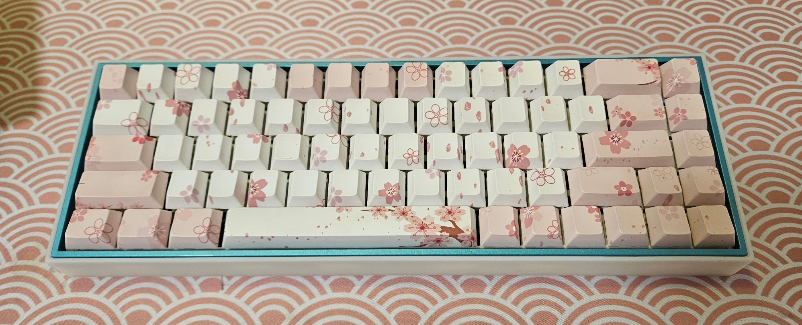
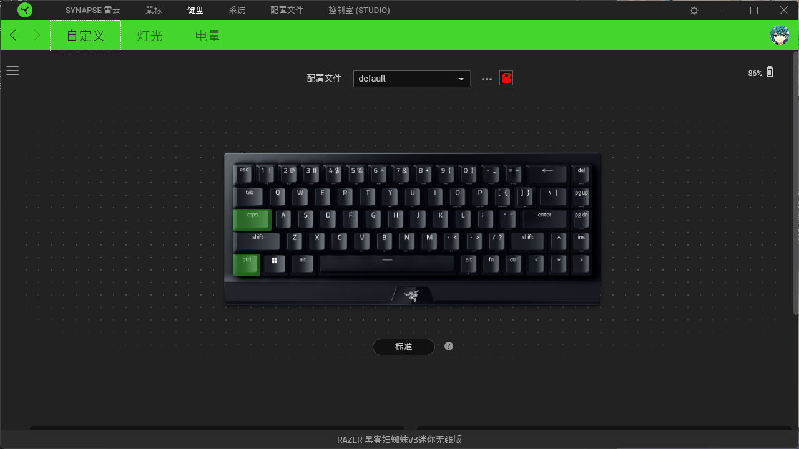
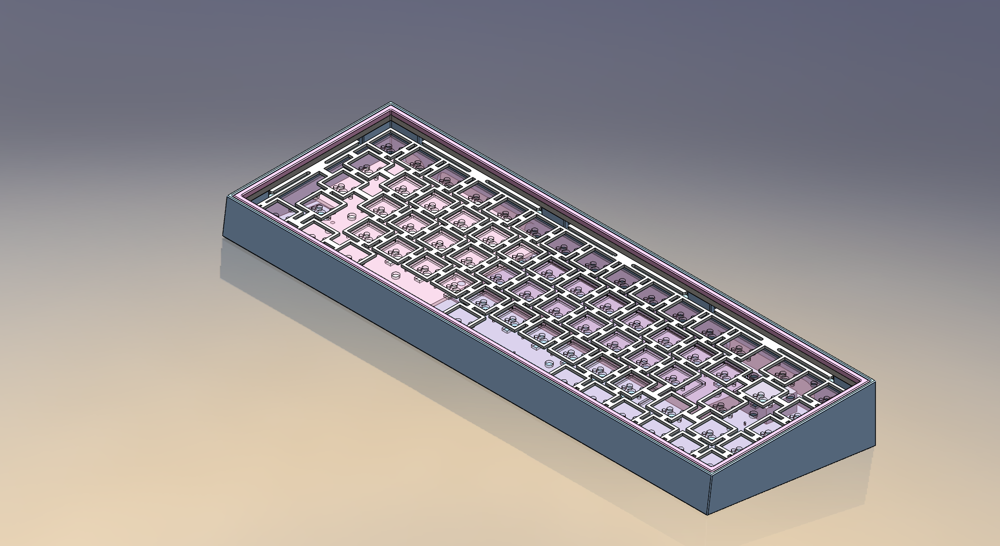
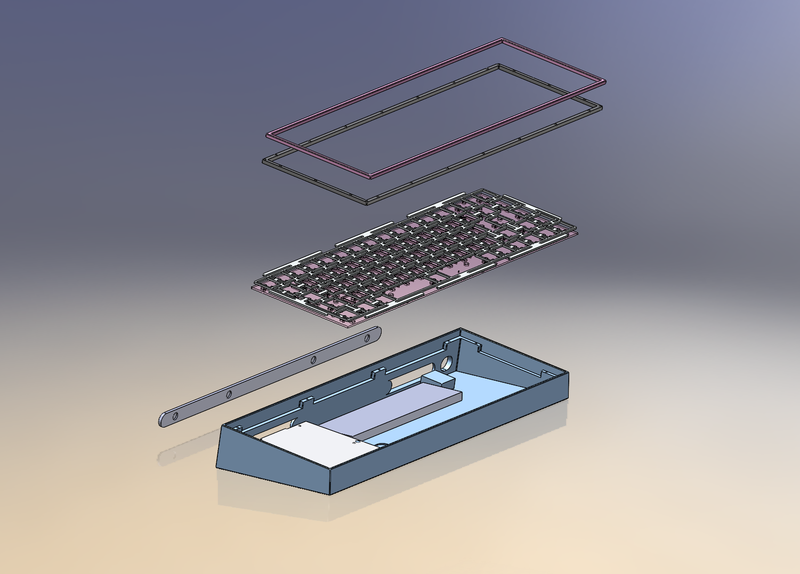
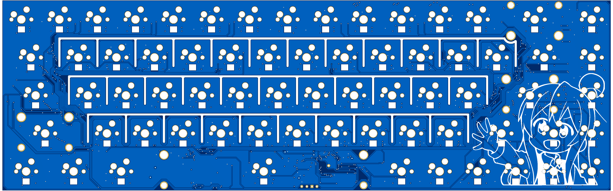
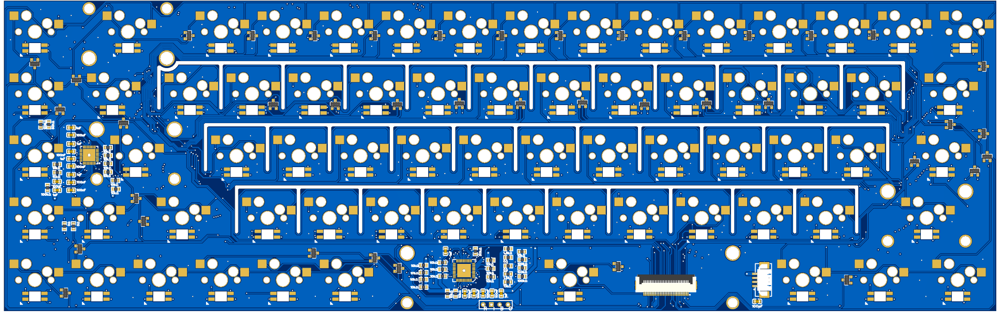

# BlackWidowV3mini-diy

重新设计了BlackWidowV3mini的外壳，使用了gasket结构，外部无螺丝，窄边框。
重新绘制了矩阵pcb，单键开槽，热插拔。

## tips
1. 模型可直接用于3D打印，如要cnc的话需要自己更改外壳的热压螺母孔为m1螺纹孔，且重新考虑天线摆放位置。
2. 3d打印上盖可能因为有长条结构出现变形，建议多打印几个组装时选择相对完美的使用。

## 成品图

# 渲染图

## pcb

## bom
1. pcb的bom参考[`pcb-bom.csv`](doc/pcb-bom.csv)
2. 组装外壳你还需要准备

|物料|数量|备注|
|:-:|:-:|:-:|
|椭圆橡胶垫 18x6x2|4|用做脚垫|
|热压螺母 m1*1.5*1.8|12|安装在外壳与上盖的连接处|
|圆形强磁铁 Φ2*1|24|安装在两个上盖中|
|圆形强磁铁 Φ6*1|8|安装在外壳与名牌上|
|泡棉 20*3*2|32|定位板上|
|自攻螺丝 m2x5|4|固定主控小板|
|扁头螺丝 m1x5|12|连接外壳与上盖|
|razer-blackWidowV3mini|1|使用原键盘的主控小板,接收器等部件|

